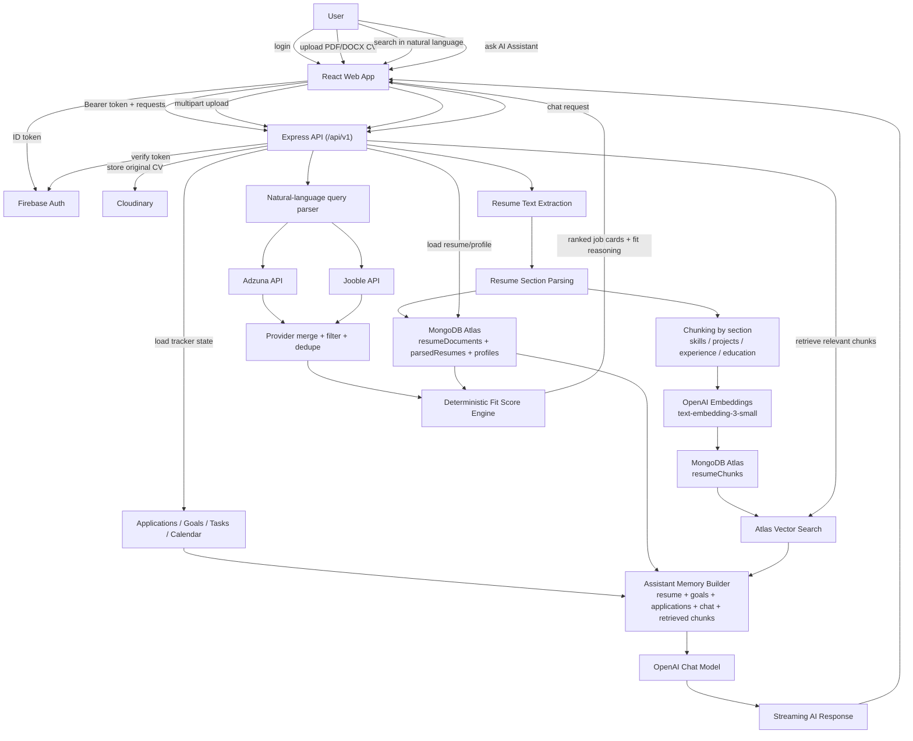

# CareerPilot

CareerPilot is an AI-powered career operating system built for the Poridhi Codesprint hackathon. It turns a user's CV into the source of truth for job search, fit scoring, AI guidance, and day-to-day execution.

It covers the four required pillars:

1. Job Hunter Agent
2. Profile and Resume Intelligence (RAG Core)
3. Personal AI Assistant
4. Productivity and Progress Tracker

## Core Features

- PDF/DOCX CV upload and parsing
- CV chunking, embedding, and vector retrieval
- Live job search with provider aggregation
- Deterministic fit score with reasoning
- AI Assistant with session memory
- Cover letter generation
- Application tracker, goals, tasks, and calendar

## Stack

- Frontend: React, Vite, TypeScript, React Router, Tailwind CSS, shadcn/ui, React Query
- Backend: Node.js, Express, TypeScript
- Database: MongoDB Atlas
- Vector Search: MongoDB Atlas Vector Search
- Auth: Firebase Auth
- Storage: Cloudinary
- AI: OpenAI
- Job Providers: Adzuna, Jooble
- Deployment: Vercel, Railway

## Architecture Diagram

This repository includes the required data-flow diagram from CV upload through agent response.



Detailed diagram and supporting docs:

- [Architecture Diagram](docs/architecture/system-diagram.md)
- [Architecture Overview](docs/architecture/overview.md)
- [RAG Architecture](docs/architecture/rag.md)
- [AI Assistant Architecture](docs/architecture/ai-copilot.md)
- [Fit Score Architecture](docs/architecture/fit-score.md)
- [Technical Documentation](docs/technical-documentation.md)
- [System Design Document](docs/system-design-document.md)

## Setup Steps

### 1. Prerequisites

- Node.js 20+
- npm
- MongoDB Atlas database
- Firebase project with Authentication enabled
- Cloudinary account
- OpenAI API key
- Adzuna API credentials
- Jooble API key

### 2. Clone and install

```bash
git clone <your-public-repo-url>
cd careerpilot
npm install
```

### 3. Create the environment file

Windows:

```bash
copy .env.example .env
```

macOS/Linux:

```bash
cp .env.example .env
```

## Required Environment Variables

### App runtime

- `NODE_ENV`
- `PORT`
- `CLIENT_URL`
- `VITE_API_BASE_URL`
- `CORS_ORIGIN`
- `LOG_LEVEL`

### MongoDB Atlas

- `MONGODB_URI`
- `MONGODB_DIRECT_URI` (recommended fallback)
- `MONGODB_DATABASE`
- `MONGODB_VECTOR_SEARCH_INDEX`

### Firebase client

- `VITE_FIREBASE_API_KEY`
- `VITE_FIREBASE_AUTH_DOMAIN`
- `VITE_FIREBASE_PROJECT_ID`
- `VITE_FIREBASE_STORAGE_BUCKET`
- `VITE_FIREBASE_MESSAGING_SENDER_ID`
- `VITE_FIREBASE_APP_ID`

### Firebase Admin

- `FIREBASE_PROJECT_ID`
- `FIREBASE_CLIENT_EMAIL`
- `FIREBASE_PRIVATE_KEY`

### Cloudinary

- `CLOUDINARY_URL` or:
  - `CLOUDINARY_CLOUD_NAME`
  - `CLOUDINARY_API_KEY`
  - `CLOUDINARY_API_SECRET`
- `CLOUDINARY_FOLDER`

### OpenAI

- `OPENAI_API_KEY`
- `OPENAI_MODEL`
- `OPENAI_EMBEDDING_MODEL`

### Job providers

- `ADZUNA_APP_ID`
- `ADZUNA_APP_KEY`
- `ADZUNA_COUNTRY`
- `JOOBLE_API_KEY`

More detail:

- [Environment Variable Guide](docs/environment-variable-guide.md)

## How To Run Locally

### Start the backend

```bash
npm run dev:api
```

Backend health check:

```txt
http://localhost:4000/api/v1/health
```

### Start the frontend

Open a second terminal:

```bash
npm run dev:web
```

Frontend:

```txt
http://localhost:5173
```

## Local Smoke Test

1. Sign in with Firebase Auth
2. Upload a PDF or DOCX CV
3. Confirm parsed resume sections appear
4. Search jobs in `/dashboard/jobs`
5. Open AI Assistant in `/dashboard/assistant`
6. Generate a cover letter
7. Track an application, goal, task, or calendar item

## Useful Commands

```bash
npm run typecheck
npm run build
```

## Demo And Judge Materials

- [System Design Document](docs/system-design-document.md)
- [Deployment Guide](docs/deployment-guide.md)
- [GitHub / Vercel / Railway Workflow](docs/github-vercel-railway-workflow.md)

