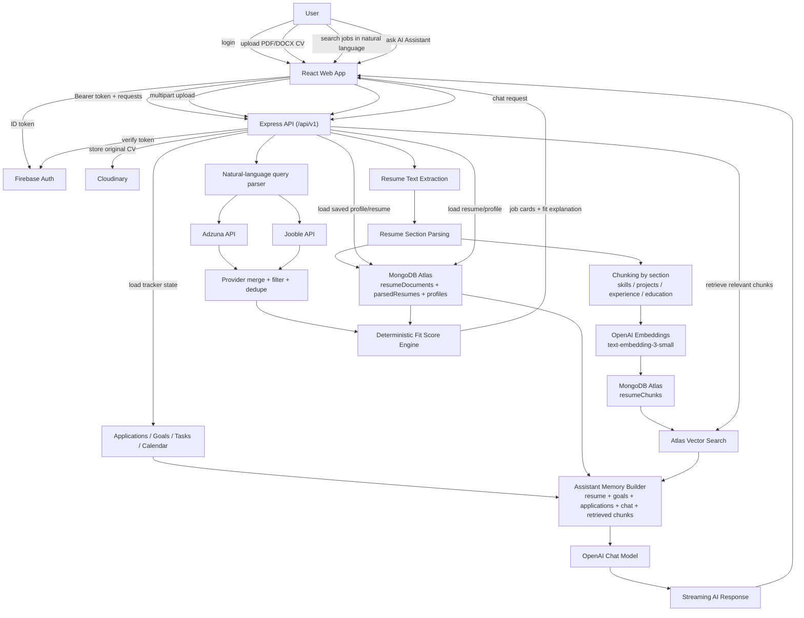

# CareerPilot Architecture Diagram

This diagram is tailored to the hackathon repository requirement: it shows the data flow from CV upload through retrieval and into the final AI assistant response.

## Reading The Flow

### CV upload path

1. The user uploads a PDF or DOCX CV.
2. The backend stores the original file in Cloudinary.
3. The backend extracts text and parses resume sections.
4. Parsed profile and resume metadata are stored in MongoDB.
5. Resume sections are chunked and embedded.
6. Resume vectors are stored in MongoDB Atlas for retrieval.

### Job-search path

1. The frontend sends one natural-language query.
2. The backend parses intent into role terms, location, date window, and job type.
3. The backend queries Adzuna and Jooble using best-effort provider-specific mapping.
4. Provider results are merged, filtered, deduped, and optionally remote-fallback is applied.
5. The fit-score engine compares those jobs against the saved CV/profile.
6. The frontend receives structured job cards ranked by deterministic fit score.

### AI assistant path

1. The user asks a question.
2. The backend assembles memory from resume data, tracker data, chat history, and relevant retrieved chunks.
3. The backend calls OpenAI with grounded context.
4. The response is streamed back to the frontend.

## Why This Matters For Judging

This diagram highlights the core judging expectations:

- the CV is the source of truth
- RAG is based on actual user data
- job search uses external providers/API calls
- fit score is computed programmatically
- the assistant response is grounded, not generic
