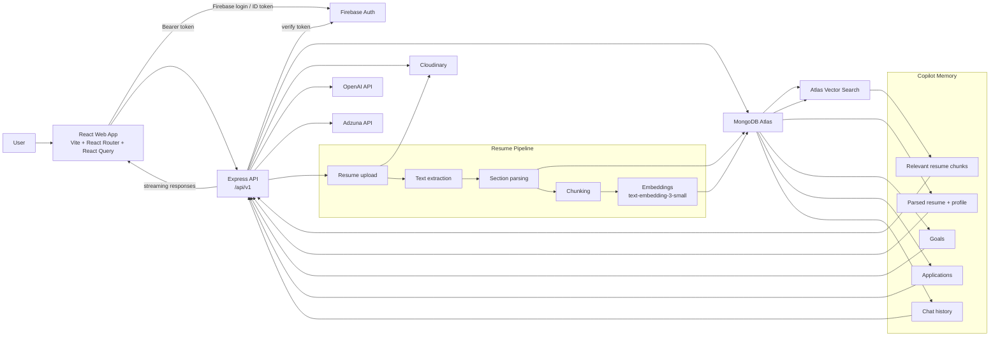

# CareerPilot System Diagram

## Reading The Diagram

- Firebase Auth is the identity authority.
- MongoDB Atlas is the product data authority.
- Cloudinary holds original resume files.
- OpenAI is used only on the backend for embeddings and Copilot generation.
- Atlas Vector Search powers retrieval over resume chunks.
- Adzuna provides external job search data.
